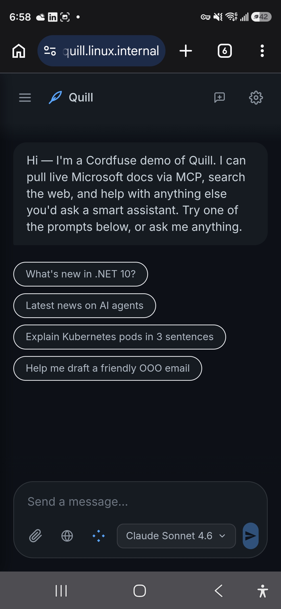
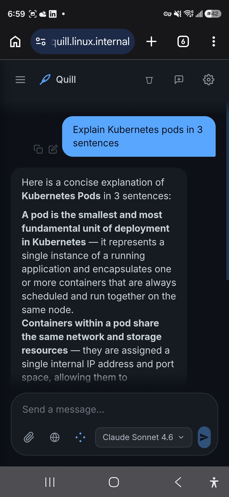
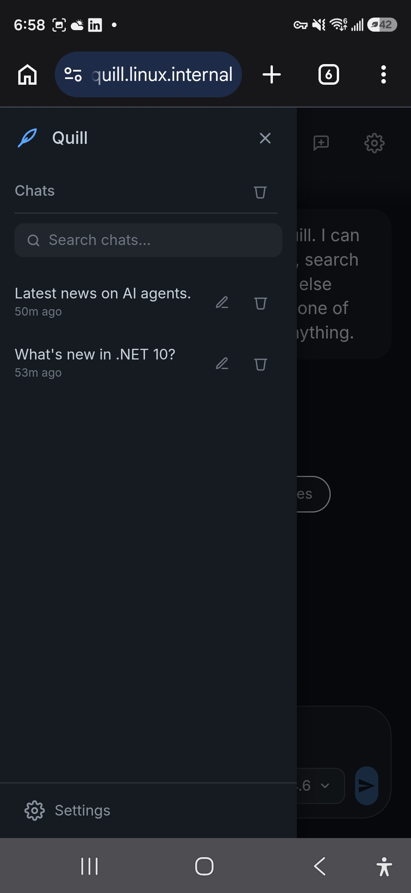
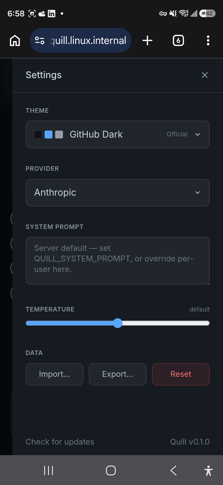

# Quill

[](https://github.com/cordfuse/quill/releases)
[](LICENSE)

<table>
  <tr>
    <td align="center"><sub>Welcome + starter prompts</sub><br></td>
    <td align="center"><sub>Streaming chat response</sub><br></td>
  </tr>
  <tr>
    <td align="center"><sub>Conversation history</sub><br></td>
    <td align="center"><sub>Settings panel</sub><br></td>
  </tr>
</table>

Embeddable AI chatbot framework. Drop-in branding, kiosk-friendly, MCP-ready.

A single Next.js app you self-host. Mount a config volume, point it at any of 12 LLM providers, and serve a polished chat UI from a Docker container in under a minute. Built to embed in third-party sites (support widget, demo kiosk, internal tool) without code changes.

## Features

- **Multi-provider via [`token.js`](https://www.npmjs.com/package/token.js)** — 9 cloud (Anthropic, OpenAI, Gemini, Groq, Mistral, Cohere, Perplexity, AWS Bedrock, AI21) + 3 local OpenAI-compatible (Ollama, llama.cpp, LM Studio). Switch with one env var.
- **MCP support** — add any number of MCP servers (HTTP or stdio) via `config/quill-mcp.json`. Tools are namespaced and auto-discovered.
- **Web search** — Tavily integration with a composer toggle. Hide the toggle to make search always-on.
- **Resumable streams** — server keeps a 5-minute replay buffer; clients reconnect via `Last-Event-ID` after dropped sockets (mobile-tab background, proxy hiccup, network blip). No lost tokens.
- **Kiosk mode** — six env flags to lock down the UI surface: settings panel, chat history, web search, MCP picker, model picker, attachments. Hidden controls still run server-side using whatever's configured.
- **Drop-in branding** — edit `config/quill.config.json` (app name, welcome message, starter prompts, theme colors, favicon, PWA icons). Next page request picks up the change. No rebuild.
- **25 built-in themes + custom themes** — 13 dark + 12 light shipped; add your own under `themes[]` in the config.
- **Document + image attachments** — PDF, DOCX, XLSX, plain text, images. Extracted server-side.
- **PWA-ready** — manifest, installable, runs offline at the shell level.
- **No database** — conversations persist in browser `localStorage` (unless kiosk mode disables persistence).

## Quick start (Docker)

```bash
cd docker/
cp .env.example .env
# Edit .env — at minimum set JWT_SECRET and one provider API key
docker compose up --build
# → http://localhost:3008
```

The container reads its branding, themes, MCP server list, and icons from a host-mounted volume (default: `../nodejs/config`). Edit any file in that dir and the next page load reflects the change.

For a Caddy-fronted TLS deployment: `docker compose -f docker-compose.prod.yml up -d --build` (edit `Caddyfile` first to set your domain).

For a deployment behind an existing host-level reverse proxy: `docker compose -f docker-compose.internal-caddy.yml up -d --build` (compose joins the external `proxy_net` network; the app exposes no host port).

## Quick start (bare-metal Node)

```bash
cd nodejs/
npm install
cp .env.example .env.local
# Edit .env.local — at minimum set JWT_SECRET and one provider API key
npm run dev
# → http://localhost:3000
```

## Configuration

All operator config lives in two places:

- **Secrets + flags** → env vars (Docker `.env` or bare-metal `.env.local`)
- **Branding + themes + MCP servers + icons** → `nodejs/config/` (the persistent volume mount in Docker setups)

### Provider API keys

Set the env var for the provider you want, plus `QUILL_PROVIDER` to select it.

| Provider | Env var(s) | Category |
|---|---|---|
| Anthropic | `ANTHROPIC_API_KEY` | cloud |
| OpenAI | `OPENAI_API_KEY` | cloud |
| Google Gemini | `GEMINI_API_KEY` | cloud |
| Groq | `GROQ_API_KEY` | cloud |
| Mistral | `MISTRAL_API_KEY` | cloud |
| Cohere | `COHERE_API_KEY` | cloud |
| Perplexity | `PERPLEXITY_API_KEY` | cloud |
| AI21 | `AI21_API_KEY` | cloud |
| AWS Bedrock | `AWS_ACCESS_KEY_ID`, `AWS_SECRET_ACCESS_KEY`, `AWS_REGION` | cloud |
| Ollama | `OLLAMA_BASE_URL` (default `http://localhost:11434/v1`) | local |
| llama.cpp | `LLAMACPP_BASE_URL` (default `http://localhost:8080/v1`) | local |
| LM Studio | `LMSTUDIO_BASE_URL` (default `http://localhost:1234/v1`) | local |
| Tavily web search | `TAVILY_API_KEY` (optional; enables the globe toggle) | — |

In Docker, point local-provider base URLs at `host.docker.internal:<port>` (the compose files set `extra_hosts: ["host.docker.internal:host-gateway"]`).

### Operator env vars

| Var | Purpose | Default |
|---|---|---|
| `JWT_SECRET` | Signs the per-device auth token. Anything ≥32 random chars. | (dev fallback — must be set in production) |
| `QUILL_PROVIDER` | Selected provider id (see table above) | `anthropic` |
| `QUILL_MODEL` | Provider-specific model id | `claude-sonnet-4-6` |
| `QUILL_SYSTEM_PROMPT` | Server-default system prompt | `"You are a helpful AI assistant."` |
| `QUILL_TEMPERATURE` | Sampling temperature | `1.0` |
| `QUILL_CONFIG_DIR` | Where `quill.config.json` + `quill-mcp.json` + `icons/` live | `./config` |
| `QUILL_SHOW_SETTINGS` | Show the settings gear (`1`/`0`) | `1` |
| `QUILL_PERSIST_CHAT` | Persist chat history to localStorage + show sidebar | `1` |
| `QUILL_SHOW_WEB_SEARCH` | Show the web search globe toggle | `1` |
| `QUILL_SHOW_MCP` | Show the MCP server picker | `1` |
| `QUILL_SHOW_MODEL_PICKER` | Show the provider/model pill | `1` |
| `QUILL_SHOW_ATTACHMENTS` | Show the paperclip | `1` |

Generate a `JWT_SECRET` with `openssl rand -hex 32`.

### Branding (`config/quill.config.json`)

```json
{
  "name": "My Bot",
  "shortName": "MyBot",
  "tagline": "What it does in one line",
  "welcomeMessage": "First assistant bubble when chat is empty. Markdown OK.",
  "starterPrompts": ["Try this", "Or this"],
  "checkForUpdatesUrl": "https://github.com/you/your-fork/releases",
  "icon192": "/branding/icon-192.png",
  "icon512": "/branding/icon-512.png",
  "defaultTheme": "dracula",
  "hideBuiltInThemes": false,
  "themes": [
    { "id": "my-brand", "name": "My Brand", "category": "light",
      "swatches": ["#ffffff", "#ff5500", "#1a1a1a"],
      "colors": { "bg": "#ffffff", "surface": "#f0f0f0", "primary": "#ff5500", "...": "..." } }
  ]
}
```

Drop your PNGs into `config/icons/` and reference them as `/branding/<filename>` — they're served by a runtime route, no rebuild needed.

### MCP servers (`config/quill-mcp.json`)

```json
{
  "servers": {
    "mslearn": { "type": "http", "url": "https://learn.microsoft.com/api/mcp", "label": "Microsoft Learn" },
    "filesystem": { "type": "stdio", "command": "npx", "args": ["-y", "@modelcontextprotocol/server-filesystem", "/data"] }
  }
}
```

MCP servers are loaded at app boot. Restart the container after editing.

### Kiosk mode

The six `QUILL_SHOW_*` flags + `QUILL_PERSIST_CHAT` let you sculpt the UI surface per deployment. Hidden = the UI control is gone; the backing feature still runs server-side using whatever's configured. To disable a feature entirely, don't configure it (e.g. omit `TAVILY_API_KEY` to disable web search even when the toggle is hidden).

Typical embedded-widget config:

```bash
QUILL_SHOW_SETTINGS=0
QUILL_PERSIST_CHAT=0
QUILL_SHOW_WEB_SEARCH=0
QUILL_SHOW_MCP=0
QUILL_SHOW_MODEL_PICKER=0
QUILL_SHOW_ATTACHMENTS=0
```

Web search and MCP keep running on every message (if their keys/configs are set) — the toggles are just hidden.

## Repo layout

```
quill/
├── nodejs/                 # the Next.js app
│   ├── app/                # routes + components
│   ├── lib/                # client + server helpers
│   ├── config/             # runtime config (mounted as a volume in Docker)
│   │   ├── quill.config.json     # branding + themes + welcome + starter prompts
│   │   ├── quill-mcp.json        # MCP server list
│   │   └── icons/                # PNGs served via /branding/*
│   └── package.json
├── docker/                 # Dockerfile + three compose variants + Caddyfile
└── .github/workflows/      # GHCR multi-arch publish on `v*` tag
```

## Architecture (one paragraph)

Next.js 15 App Router with React 19 + Tailwind. Server components SSR-render the shell and inject config into `window.__QUILL` so first paint matches the branded config (no hydration mismatch when a fork rebrands). The chat API decouples the LLM run from the HTTP response — a background promise feeds events into an in-memory replay buffer, and the response stream is one of N possible consumers (the original `POST /api/chat` plus any `GET /api/chat/replay/[id]` reconnects with `Last-Event-ID`). MCP clients are long-lived per process; tool calls are namespaced by server id and dispatched at message time. JWT-signed device tokens scope each browser to its own conversations in `localStorage`.

## Provenance

Forked from `cordfuse/mighty-ai-qr-web` on 2026-06-23 because its chat UX was further along than any minimal-fork OSS starter. Stripped to a generic foundation, then iterated on the kiosk/embed angle. Git history was reset at v0.1.0 — the lineage stays as a credit, not as code archeology.

## License

MIT. See [LICENSE](LICENSE).
